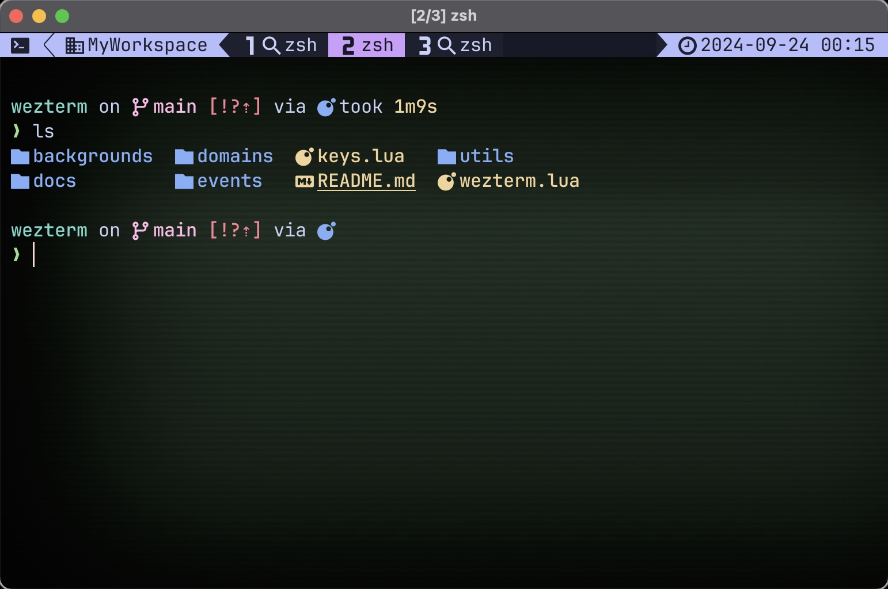

# Wezterm configuration

This is my personal configuration for [Wezterm](https://wezfurlong.org/wezterm/).
Place it in your `~/.config/wezterm/` directory.

## Status bar

Status bar is simple. 

Left side shows a nice icon and then the workspace name if not default.
Tabs show the zoom status. Tab numbers are nerdfont icons that pop. 

On the right status bar you have a clock, notification of leader being active, 
notification of zoom level and the active key table.

## The Pane Management key table

`<Leader> w` enters the terminal in to pane management mode. 

| Key         | Action                       |
|:-----------:|:-----------------------------|
| *h, j, k, l* | Activate pane in direction  |
| *Arrow*     | Activate pane in direction   |
| *SHIFT + h, j, k, l* | Resize the active pane  |
| *SHIFT + Arrow* | Resize the active pane   |
| *s*         | Split pane horizontal        |
| *v*         | Split pane vertically        |
| *r*         | Rotate panes                 |
| *m*         | Swap pane with another       |
| *z*         | Zoom pane                    |
| *1-9*       | Activate tab                 |
| *!*         | Split pane into it's own tab |
| *enter or esc* | Exit pane management mode |

## The Tab Management key table

`<Leader> t` enters the terminal in to tab management mode. 

| Key         | Action                       |
|:-----------:|:-----------------------------|
| *h, l*      | Activate tab in direction    |
| *Arrow*     | Activate tab in direction    |
| *SHIFT + h, l* | Move the active tab       |
| *SHIFT + Arrow*| Move the active tab       |
| *r*         | Rename active tab            |
| *n*         | Create a new tab             |
| *SHIFT + N* | Create a new tab with command |
| *SHIFT + X* | Close current tab            |
| *1-9*       | Activate tab                 |
| *enter or esc* | Exit pane management mode |

